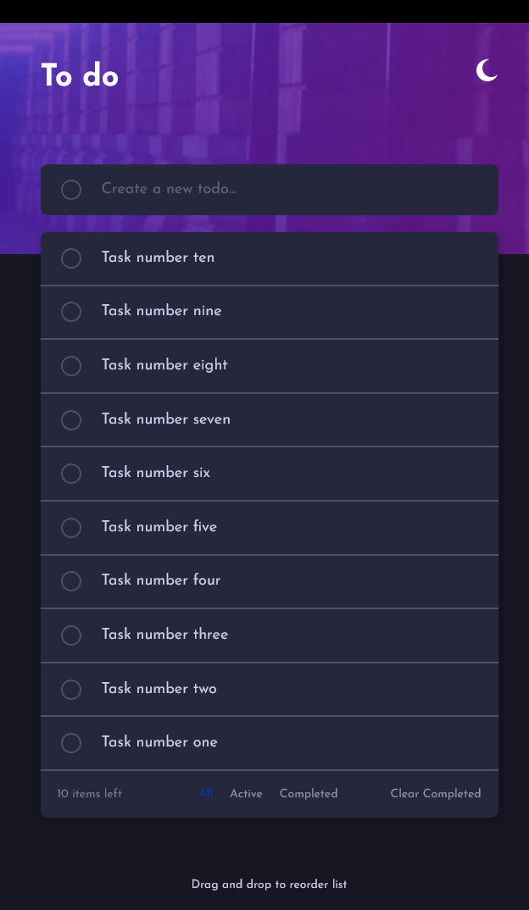
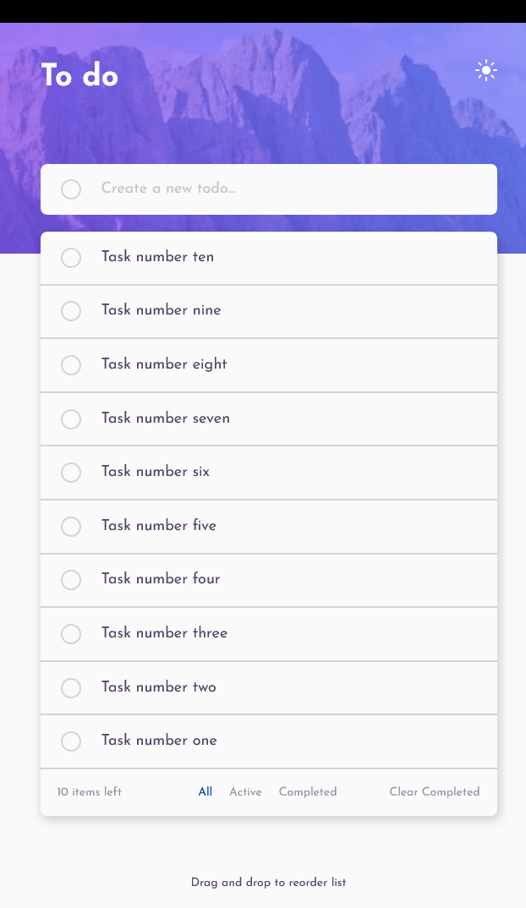

# Frontend Mentor - Todo app solution

This is a solution to the [Todo app challenge on Frontend Mentor](https://www.frontendmentor.io/challenges/todo-app-Su1_KokOW). Frontend Mentor challenges help you improve your coding skills by building realistic projects.

## Table of contents

-   [Overview](#overview)
    -   [The challenge](#the-challenge)
    -   [Screenshot](#screenshot)
    -   [Links](#links)
-   [My process](#my-process)
    -   [Built with](#built-with)
    -   [What I learned](#what-i-learned)
    -   [Continued development](#continued-development)
    -   [Useful resources](#useful-resources)
-   [Author](#author)
-   [Acknowledgments](#acknowledgments)

**Note: Delete this note and update the table of contents based on what sections you keep.**

## Overview

### The challenge

Users should be able to:

-   View the optimal layout for the app depending on their device's screen size
-   See hover states for all interactive elements on the page
-   Add new todos to the list
-   Mark todos as complete
-   Delete todos from the list
-   Filter by all/active/complete todos
-   Clear all completed todos
-   Toggle light and dark mode
-   **Bonus**: Drag and drop to reorder items on the list

### Screenshot




### Links

-   Solution URL: [Add solution URL here](https://github.com/lhomD/to-do)
-   Live Site URL: [Add live site URL here](https://lovely-gumption-e5b893.netlify.app/)

## My process

### Built with

-   Semantic HTML5 markup
-   CSS custom properties
-   Flexbox

### What I learned

Especially the reduce function was good to know. Thanks to it I was able to solve the problem.

```
function getDragedElementAfter(container, position) {
  let dragedElem = [...container.querySelectorAll(".task-container-task:not(.drag)")];

  return dragedElem.reduce((closest, child) => {
    const box = child.getBoundingClientRect()
    const offset = position - box.top - box.height / 2
    if (offset < 0 && offset > closest.offset) {
      return { offset: offset, element: child }
    } else {
      return closest
    }
  }, { offset: Number.NEGATIVE_INFINITY }).element
  }
```
